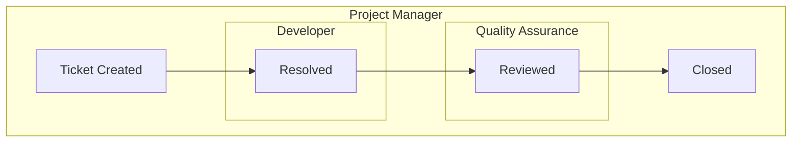

# ProjFX OOP 2 Capstone

## Group Members:
- Agbon, Jim Lord Kim P.
- Colindres, Jairus Jasper V.
- Mercado, Jahzeel Lanz N.
- Samson, James O.
- Velos, John David V.

## Project Description
The project is an extension to an already existing project that is made for discord bot. The project is to provide a graphical interface to user on handling the project management tool than just discord commands.

## Proposed Features
- One Kanban Project is linked to a hosted server(by discord bot).
Members can connect to the project via a API Key or Pass Code 
- User accounts are linked to a discord account
- When mentioned via discord or updates from a assigned ticket, the user will recieve an notifcation

### Graphical Tabs
- Board - diaplay all of the tickets and arrange according by status 
- My Work - List of user's assigned tickets 
- Backlog - A place for ideas and tasks that aren't ready for the board yet. (Needs to adjust/add server logic) 
- Team - A simple directory of who is on the project. This is where to manage invites or see what everyone is currently working on

### User Roles
#### Project Manager:
- Create tickets
- ticket assignes
- assigne member roles
- manage tickets 

#### Developer
- claim ticket
- can set ticket resolved

#### QA
- set ticket Reviewed

### Ticket States

## Planned Technologies
- [SQLite](https://sqlite.org/)
- [Discord.py](https://discordpy.readthedocs.io/en/stable/)
- [JavaFx](https://openjfx.io/)

