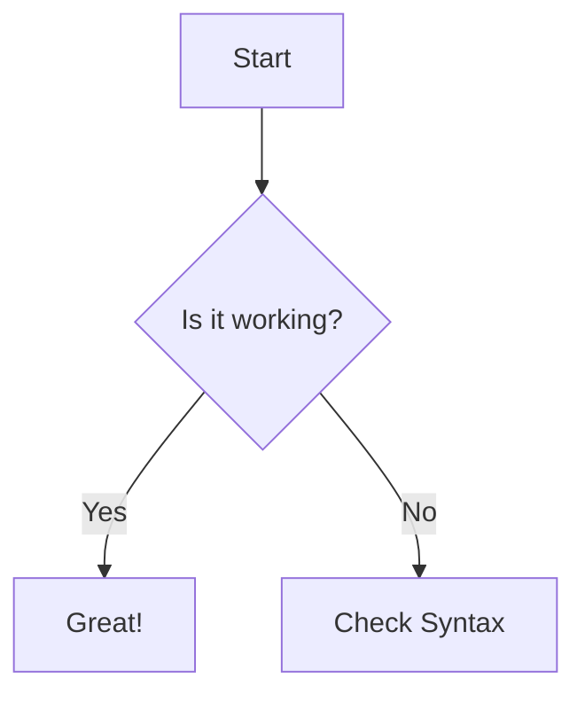

# ProjFX OOP 2 Capstone

## Group Members:
- Agbon, Jim Lord Kim P.
- Colindres, Jairus Jasper V.
- Mercado, Jahzeel Lanz N.
- Samson, James O.
- Velos, John David V.

## Project Description
The project is an extension to an already existing  

## Proposed Features
- One Kanban Project is linked to a hosted server(by discord bot).
Members can connect to the project via a API Key or Pass Code 
- User accounts are linked to a discord account

- Tabs: Main, Your Tickets
- Notification when mentioned or updated related to user

### User Roles
#### Project Manager:
- Create tickets
- ticket assignes
- assigne member roles
- manage tickets 

#### Developer
- claim ticket
- can set ticket resolve/unresolve

#### QA
- set ticket

## Planned Technologies
- [SQLite](https://sqlite.org/)
- [Discord.py](https://discordpy.readthedocs.io/en/stable/)
- [JavaFx](https://openjfx.io/)

## Evaluation Criteria Mapping